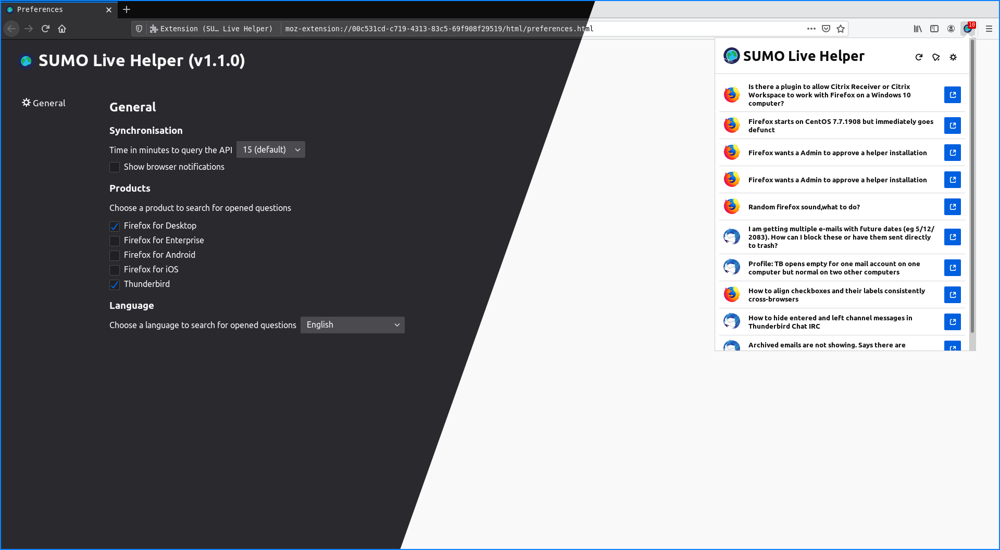

[ ![Get Addon][amo-button] ][amo-website]

#  SUMO Live Helper ![Version][version]

An extension to help SUMO contributors to quickly and easily find unanswered
questions on [Mozilla Support](https://support.mozilla.org).

## Requirements

* Operating system: Windows, MacOS, Linux and Android
* Firefox version: Latest ESR or greater

## Features

* Choose the interval of time to search for new opened questions
* Support browser notifications
* Choose to open questions in new tab
* Search unanswered questions for:
 * Firefox for Desktop
 * Firefox for Enterprise
 * Firefox for Android
 * Firefox for iOS
 * Mozilla VPN
 * Hubs
 * Thunderbird
* Translated in 8 languages:
 * Čeština
 * Español
 * English
 * French
 * Magyar
 * Polski
 * Português (do Brasil)
 * Svenska
* Select between 11 languages to search for unanswered questions:
 * Čeština
 * English
 * Español
 * Suomi
 * Magyar
 * Bahasa Indonesia
 * Italiano
 * Português (do Brasil)
 * Slovenščina
 * Српски
 * Sesotho
* Choose to search unanswered questions for more than one language at the same time
* Includes a dark and light theme
* Navigate unanswered questions using the toolbar popup or a sidebar

## How to Contribute

Read [our contributing guide](.github/CONTRIBUTING.md)

## License

Copyright (c) 2019-2020 Jhonatas Machado, Wesley Branton, Danny Colin

This Source Code Form is subject to the terms of the Mozilla Public
License, v. 2.0. If a copy of the MPL was not distributed with this
file, You can obtain one at https://mozilla.org/MPL/2.0/.

<!-- link references -->
[amo-button]: https://addons.cdn.mozilla.net/static/img/addons-buttons/AMO-button_2.png
[amo-website]: https://addons.mozilla.org/en-US/firefox/addon/sumo-live-helper-/
[version]: https://img.shields.io/github/v/tag/mozillabrasil/sumo_live_helper?label=Version&sort=semver&style=flat-square
