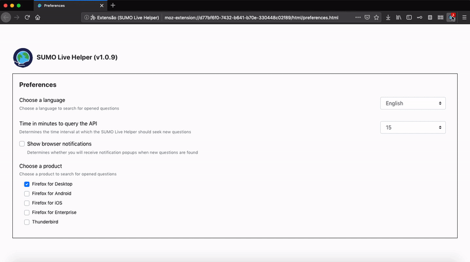

[](https://github.com/mozillabrasil/sumo_live_helper/issues)
[](https://github.com/mozillabrasil/sumo_live_helper/blob/master/LICENSE)
[](https://github.com/mozillabrasil/sumo_live_helper/network/members)
[](https://github.com/mozillabrasil/sumo_live_helper/stargazers)
[](https://github.com/mozillabrasil/sumo_live_helper/releases)


# SUMO Live Helper [](https://addons.mozilla.org/en-US/firefox/addon/sumo-live-helper-/)
The goal of this Add-on is give to all volunteers of SUMO (Support Mozilla) a tool to see when there are new support questions in the forums that have not yet been answered. This will help to improve the Mozilla products user experience by getting answers to their problems more quickly.



## Requirements
* Firefox 58.0 or later

## Features
This Add-on shows how many questions are open and without answer on the support forum, by clicking the Add-on on the toolbar a menu will be opened to choose a question to open in a new tab. Some preferences can be changed at preferences page:
- Choose a language to search for questions opened recently and without answer
    - Čeština
    - Español
    - English
    - Português (do Brasil)
    - Magyar
- Time in minutes to query the API
- Show browser notifications when a new question is opened
- Choose a product to search for opened questions
    - Firefox for Desktop
    - Firefox for Enterprise
    - Firefox for Android
    - Firefox for iOS
    - Thunderbird
- Localized for the following languages
    - Čeština
    - Español
    - English
    - Português (do Brasil)

## Informations
1. The search of new opened questions at support forum is in English for default, but you can change in the preferences page and set the time to search for questions as well (the default is each 15 minutes).
2. The Add-on will show to you the questions that have been opened giving to you the option to choose and open in a new tab.

## Future implementations
We are looking forward to see what you think is a good idea implement in the future, please to do that open a new [issue](https://github.com/mozillabrasil/sumo_live_helper/issues).

## How to test this Add-on
1. Clone this repository git clone ```https://github.com/mozillabrasil/sumo_live_helper.git```
2. In the Firefox address bar type ```about:debugging```
3. Click ```Load Temporary Add-on```, a dialog window opens
4. In the cloned repository, select the ```manifest.json``` file. The Add-on icon will appear in your toolbar.

## How Contribute
Have a suggestion, doubt or encountered an error? Please open a new [issue](https://github.com/mozillabrasil/sumo_live_helper/issues).

Contributions are welcome, feel free to submit a pull :)

## Learn More
To learn more about webextensions development, see this [Mozilla developer Network documentation](https://developer.mozilla.org/en-US/Add-ons/WebExtensions).

### License
This repository is available under the [Mozilla Public License 2.0](https://github.com/mozillabrasil/sumo_live_helper/blob/master/LICENSE).

### Credits
Thank you [philipp-sumo](https://github.com/philipp-sumo/) for your helpfull tips and time to revive this project.
